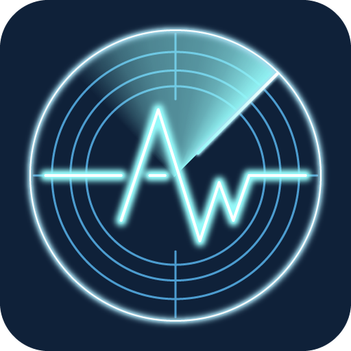
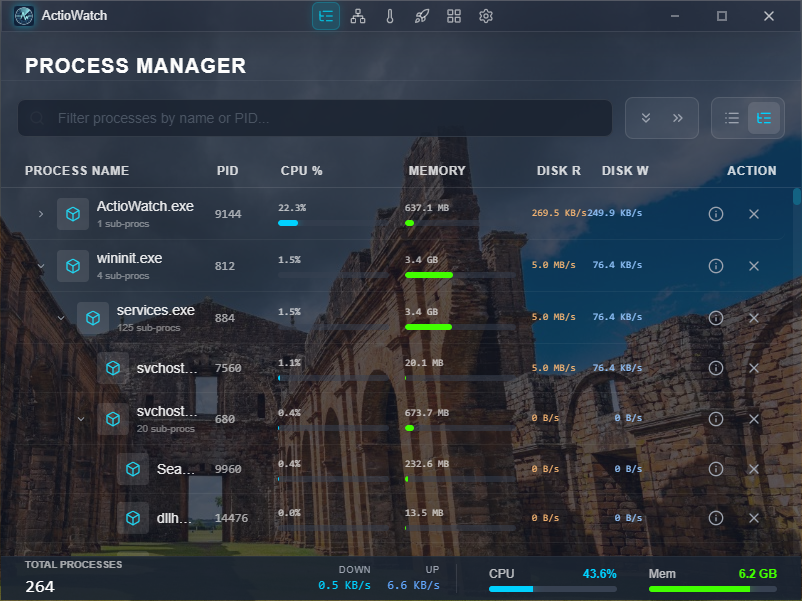
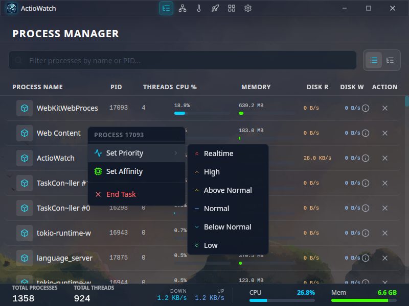
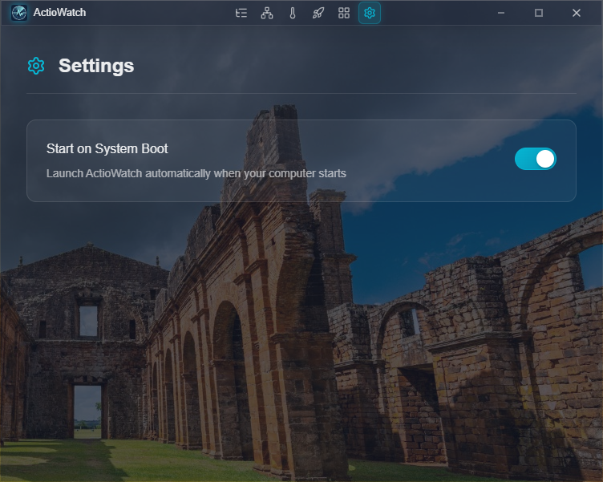
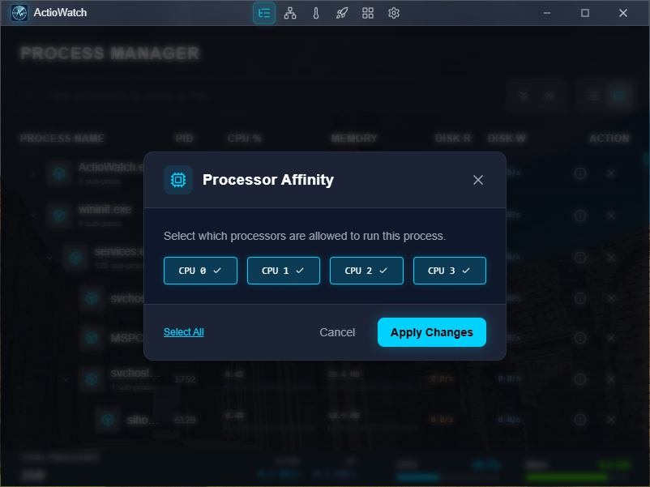
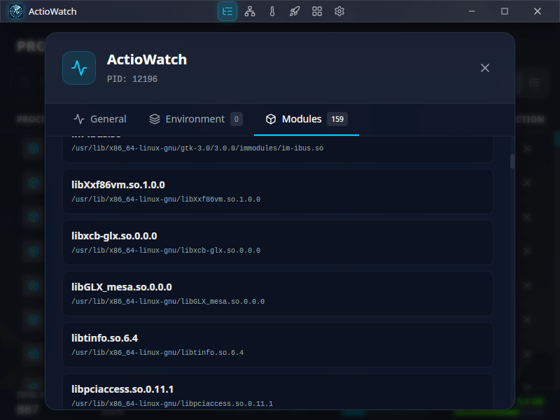
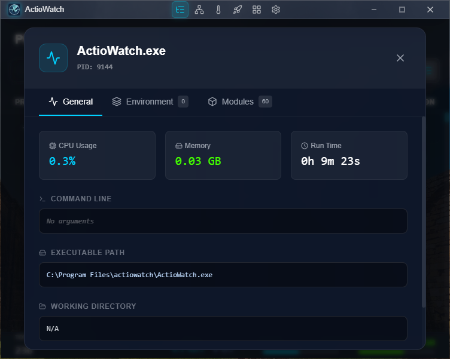
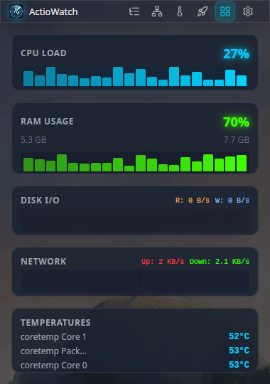
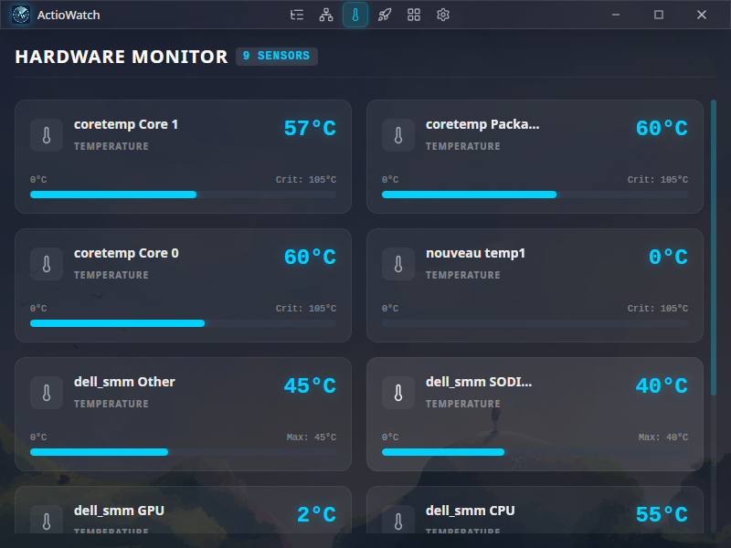

#  ActioWatch

**ActioWatch** is a high-performance, cross-platform system monitoring and process management tool built with **Rust** and **Tauri**. Designed for power users and developers, it provides real-time insights into system resources and granular control over running processes, wrapped in a modern, aesthetic interface.



## Features

### 🚀 Advanced Process Management
-   **Real-time Monitoring**: View detailed statistics for all running processes, including CPU usage, memory consumption, disk I/O, and thread count.
-   **Granular Control**:
    -   **Kill Process**: Terminate unresponsive or unwanted applications instantly.
    -   **Set Priority**: Adjust process execution priority (Realtime, High, Above Normal, Normal, Below Normal, Low) to optimize system performance.
    -   **Set Affinity**: Bind processes to specific CPU cores to maximize efficiency or isolate workloads.
-   **Search & Filter**: Quickly locate processes by name or PID.

### 📊 Hardware Monitor
-   **Comprehensive Stats**: Monitor global CPU load, RAM usage, Disk I/O speeds, and Network upload/download rates.
-   **Temperature Sensors**: Real-time tracking of hardware temperatures (CPU, GPU, etc.) where supported.
-   **Visualizations**: Dynamic graphs and progress bars for immediate visual feedback of system health.

### 🌐 Network Ports
-   **Open Ports**: Scan and list all open ports on your system (TCP/UDP).
-   **Process Association**: Identify which process is listening on a specific port.
-   **Detailed Info**: View local and remote addresses, state, and protocol for each connection.

### 🧩 Widget Mode
-   **Compact Overlay**: Switch to a sleek, always-on-top widget mode that displays essential system statistics without cluttering your workspace.
-   **Responsive Design**: Optimized layout for quick glancing at system vitals.

### 🔔 Smart Notifications
-   **Resource Alerts**: Receive desktop notifications when system CPU or Memory usage exceeds critical thresholds.
-   **Process Warnings**: Get notified if a specific process is consuming excessive memory.

### 💻 Cross-Platform
-   **Windows & Linux**: Fully optimized for both operating systems, with platform-specific implementations for low-level system interactions.
-   **System Tray Integration**: Quick access to toggle visibility, switch modes (Standard/Widget), or exit the application.

### 🎨 Modern UI/UX
-   **Glassmorphism Design**: A sleek, translucent interface with blur effects that blends beautifully with your desktop environment.
-   **Dark Mode**: Optimized for low-light environments and visual comfort.

## Technology Stack

ActioWatch leverages modern web technologies for the frontend and the performance of Rust for the backend:

-   **Core**: [Tauri v2](https://tauri.app/) (Rust)
-   **Frontend**: [Vue 3](https://vuejs.org/), [TypeScript](https://www.typescriptlang.org/)
-   **Styling**: [TailwindCSS](https://tailwindcss.com/)
-   **Icons**: [Lucide Vue](https://lucide.dev/)


## Installation

### Prerequisites
-   **Rust**: Ensure you have the latest stable version of Rust installed.
-   **Node.js**: Requires Node.js (LTS recommended) and npm/pnpm/yarn.

### Build from Source

1.  **Clone the repository:**
    ```bash
    git clone https://github.com/xScherpschutter/ActioWatch.git
    cd ActioWatch
    ```

2.  **Install dependencies:**
    ```bash
    npm install
    ```

3.  **Run in development mode:**
    ```bash
    npm run tauri dev
    ```

4.  **Build for production:**
    ```bash
    npm run tauri build
    ```
    The executable will be located in `src-tauri/target/release/bundle/`.

## Gallery

| Priority | Startup Manager |
| :---: | :---: |
|  |  |

| Network Ports | Settings |
| :---: | :---: |
|  |  |

| Affinity | Process Modules |
| :---: | :---: |
|  |  |

| Process Details | Widget Mode |
| :---: | :---: |
|  |  |

| Hardware Monitor | Three View |
| :---: | :---: |
|  |  |

## License

This project is licensed under the MIT License - see the [LICENSE](LICENSE) file for details.
